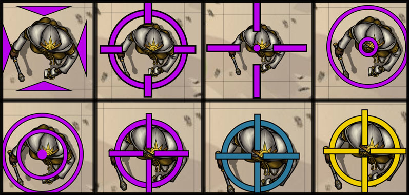

# Smart-Target
## Before opening an issue read [THIS](https://github.com/theripper93/Levels/blob/v9/ISSUES.md)

    

## You can find the documentation on the [WIKI](https://api.theripper93.com/modulewiki/smarttarget/free)

## Features

1. Target with Alt+Click
2. For players, target by just left clicking a non-owned token (Alt+Click to target owned token)
3. Target all tokens in a template by Alt+Clicking the template (shift modifier and standard\sticky behaviour apply)
4. Show portraits instead of colored pips to indicate targets, positioning\offset and size of the icons can be configured in the module settings
5. Customize color\shape of the targeting reticule

